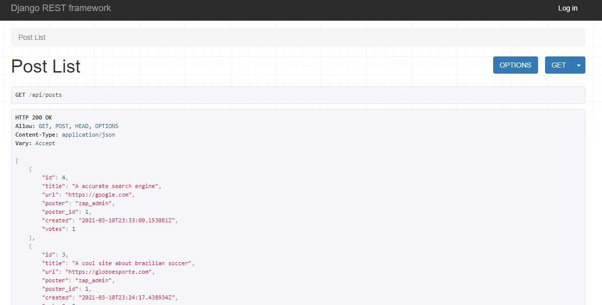
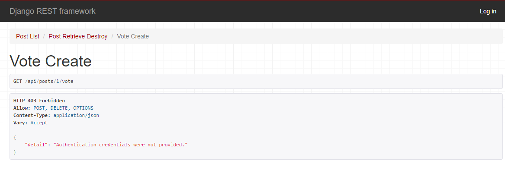

Zappit - A Django REST API
======

Zappit is an Rest API built with Django Rest Framework with functions that mimic those used on Reddit.
With it you are able to create and delete post, as well as vote and check the total amount of votes for that post.
------

Zappit is a project developed over the course "Creating Python APIs Like a BOSS" by ZappyCode. 

## Screenshots

- Post List

- Create Vote
  
  
## Getting started

To run the project, you will need to install the following software:

- [Python 3.9.*: Required to run the Python project](https://www.python.org/ftp/python/3.9.2/python-3.9.2-amd64.exe)
- [Django 3.1.*:  A Python Web framework.](https://pypi.org/project/Django/)
- [Django REST framework: A powerful and flexible toolkit for building Web API.](https://www.django-rest-framework.org/)

### Features

Using the API, you will be able to:

- [x] Login / Log out
- [x] List the posts (To all users)
- [x] Create, Update and Delete Post (Only authenticated users)
- [x] Create and Delete Vote (Only authenticated users)

## Authors

Marcos Garcia   
e-mail: mvrgarcia05@gmail.com
